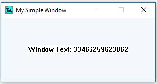

win_text_simple
==================

    
    
    

win_text_simple makes a simple Win32-API window with dynamic
_Window_ _Text_.

## The Win32-API and ckormanyos/win_text_simple

In chapter 2 of [1], the author describes and provides a code listing
for a simple text-based window. The example uses what was then known as the
Windows 95 API, which would later become the Win32-API.

Microsoft(R) Visual Studio(R) products (even Community-Editions)
support the traditional Win32-API, also for _x64_ builds.
This API is very conventient and can still be used today
to program Windows(R)-based applications.

ckormanyos/win_text_simple generally follows the code supplied in
Fig. 2-1 _The_ _HELLOWWIN_ _Program_ of [1]. It does, however,
add additional timer and threading facilities to create a dynamic,
text-based Win32-API program.

The main assignment of the program is a non-trivial functionality.
A self-written `WM_TIMER` event/handler is used to query and
dynamically print the value of `std::chrono`'s
high-performance clock in the text field of the window.
A decimal 64-bit representation (in nanoseconds)
of the running tick is used.

## Implementation

The application is written in header-only, modern C++ and is compatible
with C++14, 17, 20, 23 and beyond.

Standard Windows(R) message pump technology is used. An additional `WM_TIMER`
message and handler have been added for handling the interaction
with `std::chrono`.

A C++ `std::thread` object is used for synchronization
and properly shutting down and de-registering the window.

## Continuous Integration

Continuous integration runs in GitHub Actions using the `windows-latest`
image. The Ci jobs build the _x64_, _Release_ version
of the application and check for the existence of the executable.
VS-versions 15, 16, 17 and latest are used.

## References

[1] C. Petzold, _Programming_ _Windows(R)_ _95_,
Microsoft Press 1996.
